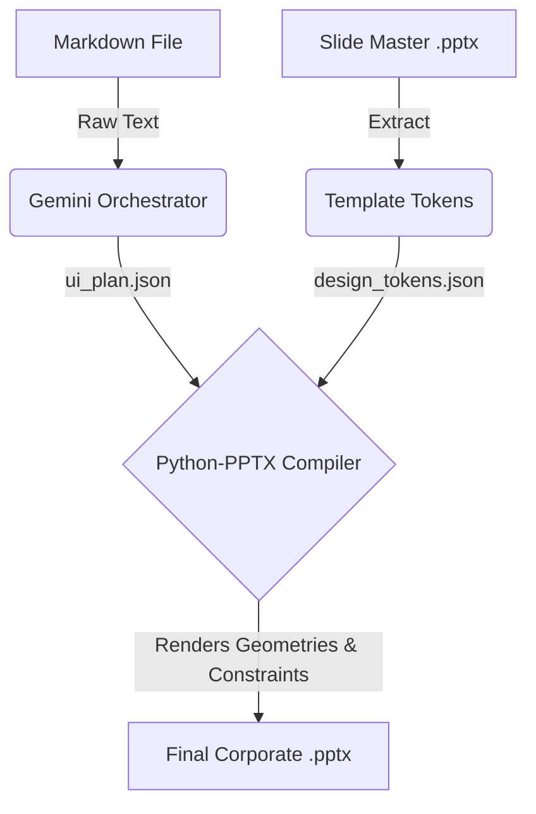

# PPT Maker v2: Automated Markdown to PowerPoint Engine

PPT Maker v2 is a robust, autonomous presentation generation engine that bridges unformatted textual content and corporate slide branding. The pipeline cleanly intercepts text-heavy markdown documents (like whitepapers and case studies), mathematically breaks them down using large language models, and outputs flawlessly branded, agency-grade `.pptx` presentations bound to any custom template.

---

## 🏗️ Core Architecture

The system operates across a strict 3-stage pipeline architecture to decouple content processing from visual rendering:



### 1. Stage 1: Ingestion (`ingest.py`)
The pipeline begins by loading the target corporate **Slide Master `.pptx`** template. It autonomously extracts critical design "tokens" (primary and accent colors, typography maps, bounding box dimensions, and geometric coordinates) mathematically scaling them into a flexible `design_tokens.json`.

### 2. Stage 2: Orchestration & Planning (`orchestrator.py`)
The system takes the raw user `Markdown` document and heavily prompts **Google Gemini (v3-flash-preview)**. The LLM acts as an Orchestrator, dynamically chunking long paragraphs, summarizing data, and mapping the markdown into specific geometric layouts (like Timelines, Pyramids, Icon Grids, and Charts). This relies on a strictly mandated `pydantic` schema to output a highly predictable `ui_plan.json`.

### 3. Stage 3: Compilation (`compiler.py` & `server.py`)
This is the core native rendering engine built over `python-pptx`.
* **Dynamic Binding:** It takes the geometric instructions from the `ui_plan` and the visual constraints from `design_tokens` and weaves them together.
* **Smart Contrast:** Structural elements (chart legends, timeline badges, icon placeholders) programmatically inherit maximum-contrast text anchors (`dk1` against `lt1`) to completely prevent visual "washing out" regardless of template color maps.
* **Auto-Scaling Typography:** Overfilling title boxes trigger dynamic font shrinkage algorithms (`Pt(22)` -> `Pt(18)`) to forcefully prevent text overlapping onto underlying charts or layouts.
* **Layout Intercepts:** Handles image placeholders gracefully (disabling visual text overlays if overlapping layers demand transparent space).

---

## 🛠️ Setup & Installation

### Prerequisites
1. You must have Python installed (preferably via `conda`).
2. A required Google Gemini API Key.

### 1. Clone the Repository
```bash
git clone https://github.com/YourUsername/PPT_Maker_AI.git
cd "PPT_Maker_AI"
```

### 2. Environment Setup
Construct your python environment and install the required native dependencies (`python-pptx`, `google-genai`, `pydantic`):
```bash
conda create -n llmenv python=3.10 -y
conda activate llmenv
pip install python-pptx google-genai pydantic python-dotenv
```

### 3. Configure API Keys
Copy the `.env.example` file to create a local `.env` configuration file:
```bash
cp .env.example .env
```
Inside the `.env` file, add your secure Gemini API Key:
```env
GEMINI_API_KEY=AIzaSy...
PEXELS_API_KEY="" # Optional
```

---

## 🚀 Execution & Usage

The application uses `server.py` as a centralized pipeline runner. You can feed it any detailed Markdown file alongside any blank Corporate Slide Template.

### The Universal Command
To run all 3 stages (Ingest -> Plan -> Compile) automatically:

```bash
python server.py generate --markdown "Path\To\Your\Content.md" --template "Path\To\Your\Slide_Master.pptx" --output "output\Final_Presentation.pptx"
```

**Example Run:**
```bash
python server.py generate --markdown "Test Cases\Test Cases\Automobile_Industry_Supply_Chain_Disruptions_Post-COVID_and_Russia-Ukraine_War_20250624_110931.md" --template "Slide Master\Slide Master\Template_AI Bubble_ Detection, Prevention, and Investment Strategies.pptx" --output output\Cross_Test_Auto_Theme_AI.pptx
```

### Individual Pipeline Stepping
If you are debugging UI outputs, you can decouple the pipeline:
1. **Ingest Tokens:** `python server.py ingest --template <template.pptx> --output output/`
2. **Plan Content:** `python server.py plan --markdown <text.md> --tokens output/design_tokens.json`
3. **Compile Final:** `python server.py compile --tokens output/design_tokens.json --plan output/ui_plan.json --template <template.pptx> --output <final.pptx>`
